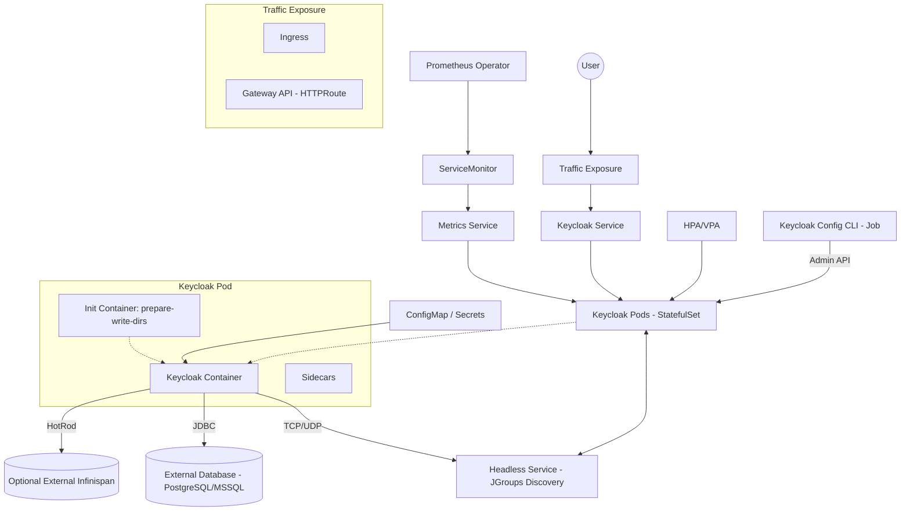

> **Note**: This project is a fork of the [Bitnami Keycloak Helm chart](https://github.com/bitnami/charts/tree/main/bitnami/keycloak) - AI assisted

# [Keycloak](https://www.keycloak.org/) Helm chart

Keycloak is a high-performance, Java-based open-source Identity and Access Management (IAM) solution. It allows developers to add a robust authentication layer to their applications with minimal effort, supporting industry-standard protocols such as **OpenID Connect (OIDC)**, **SAML 2.0**, and **OAuth 2.0**.

This Helm chart enables the deployment of Keycloak on a [Kubernetes](https://kubernetes.io) cluster in a highly available and production-optimized manner. Unlike standard deployments, this chart focuses on a **Cloud-Native** architecture, prioritizing statelessness, external databases, and advanced observability.

### Deployment Highlights:
- 🔐 **Enhanced Security**: Native Zero-Trust support and secret isolation.
- 🚀 **Maximum Scalability**: "Clusterless" mode for horizontal scaling without the complexity of JGroups in the Cloud.
- 📊 **Native Observability**: Deep integration with OpenTelemetry, Prometheus, and logs in ECS (Elastic Common Schema) format.
- 🌍 **Multi-Site & Geo-Redundancy**: Session sharing capabilities across multiple regions or datacenters via external Infinispan.

## Table of Contents

- [Installation & Quick Start](#installation--quick-start)
- [Fork Overview](#fork-overview)
- [Architecture](#architecture)
- [Chart internal descriptions](docs/architecture.md)
- [Database & Images](docs/config-database.md)
- [Realms & Config-CLI](docs/config-realms.md)
- [Networking & TLS](docs/config-networking.md)
- [Cache & Clusters](docs/config-cache.md)
- [Observability & Logs](docs/config-observability.md)
- [Operations Guide](docs/config-operations.md)
- [Parameters Reference](docs/parameters.md)
- [Troubleshooting & Upgrading](#troubleshooting--upgrading)
- [License](#license)

## Installation & Quick Start

### Prerequisites

- Kubernetes 1.23+
- Helm 3.8.0+
- **Keycloak 26.0.0+** (This chart is optimized for Keycloak 26+ and its Quarkus distribution)

### Installing the Chart

To install the chart using the OCI registry:

```console
helm install my-release oci://ghcr.io/mcarbonneaux/charts/keycloak --version latest --set dbHost=mypostgresql
```

> **Note**: Replace `mcarbonneaux` with the appropriate GitHub username/organization. The version used in the command must match an existing Git tag published to the registry.

Alternatively, to install from the local directory:

```console
helm install my-release . --set dbHost=mypostgresql
```

### Releasing the Chart (Maintenance)

This chart is automatically packaged and pushed to the OCI registry when a Git tag starting with `v` is pushed to the repository:

1. Update `version` and `appVersion` in `Chart.yaml`.
2. Commit and push your changes.
3. Create and push a new tag:
   ```console
   git tag v1.0.6
   git push origin v1.0.6
   ```
4. The GitHub Action will trigger and release the new version to GHCR.

These commands deploy a Keycloak application on the Kubernetes cluster in the default configuration.

> **Tip**: List all releases using `helm list`

For detailed configuration options, please refer to the [Configuration Guide](docs/config-database.md).

## Fork Overview

This chart is a **production-optimized fork** of `bitnami/keycloak` (originally v25.3.2), updated to Keycloak **v26.5.5** with significant architectural improvements.

### This Fork are Designed for:
- 🚀 **Remove bitnami dependency**
- ☁️ **Cloud-native production** deployments
- 📈 **High-scale, multi-cluster** environments
- 🌍 **Multi-datacenter/multi-region** architectures
- 📊 **Advanced observability** requirements (ELK, Loki, OTel)
- 🔒 **Zero-trust, stateless** security models
- 🚀 **Kubernetes-native** best practices (no PVCs, external state)

### Key Differences from Bitnami Chart

| Feature | Bitnami Chart | This Fork |
|---------|---------------|-----------|
| **Database** | Bundled PostgreSQL subchart | **External database required** (production-ready) |
| **Keycloak Image** | `docker.io/bitnami/keycloak:26.3.3-debian-12-r0` | `quay.io/keycloak/keycloak:26.5.5` (official) |
| **Dependencies** | `bitnami/common` + `bitnami/postgresql` | **Zero chart dependencies** (self-contained) |
| **Deployment Modes** | StatefulSet only | **StatefulSet + Deployment** |
| **Cache Scenarios** | Internal cache only | **4 deployment scenarios** (internal, clusterless, persistent, multisite) |
| **External Infinispan** | Basic support | **Full integration** with clusterless mode |
| **Traffic Exposure** | Ingress only | **Ingress + Gateway API (HTTPRoute)** |
| **Logging** | JSON support | **JSON + ECS format + OpenTelemetry** |
| **Observability** | Basic metrics | **Production logging stack** (Fluent Bit, Vector, OTel) |

### Major Enhancements

✅ **Production-Grade Database Configuration**
- Removed internal PostgreSQL dependency for production readiness
- Simplified database configuration with flat `db*` parameters
- Mandatory external database (PostgreSQL required)

✅ **Advanced Deployment Scenarios**
- **Scenario 1**: Default StatefulSet with internal cache
- **Scenario 2**: Clusterless mode (fully stateless, maximum scalability)
- **Scenario 3**: Persistent user sessions (external Infinispan)
- **Scenario 4**: Multisite deployment (global session sharing)

✅ **Enhanced Logging & Observability**
- JSON logging with ECS (Elastic Common Schema) transformation
- OpenTelemetry logs support (Keycloak 24+)
- Integration guides for: Fluent Bit, Vector, OpenTelemetry Collector
- Kafka-based log pipeline architecture
- ELK stack integration with ECS mapping

✅ **Stateless Architecture**
- All state in external database + Infinispan (scenarios 2-4)
- `emptyDir` volumes for local cache and temporary files
- Clusterless mode for fully stateless deployments
- Perfect for cloud-native, autoscaling deployments

✅ **Simplified Configuration**
- Removed `bitnami/common` dependency complexity
- Cleaner values.yaml structure
- Direct parameter naming (no `externalDatabase.*` nesting)

### Breaking Changes from Bitnami

⚠️ **Migration Required**: This chart is **NOT** a drop-in replacement for the Bitnami chart.

**Database Parameters Renamed:**

| Bitnami Parameter | This Fork | Example |
|-------------------|-----------|---------|
| `postgresql.enabled=false` | _(removed)_ | Not applicable |
| `externalDatabase.host` | `dbHost` | `postgres.example.com` |
| `externalDatabase.port` | `dbPort` | `5432` |
| `externalDatabase.database` | `dbDatabase` | `keycloak` |
| `externalDatabase.user` | `dbUser` | `keycloak` |
| `externalDatabase.password` | `dbPassword` | `secret` |
| `externalDatabase.schema` | `dbSchema` | `public` |
| `externalDatabase.extraParams` | `dbExtraParams` | `sslmode=require` |
| `externalDatabase.existingSecret` | `dbExistingSecret` | `db-credentials` |

**Other Breaking Changes:**
- **`postgresql.*` removed**: Internal PostgreSQL subchart eliminated - external database is mandatory
- **`image.pullSecrets`**: Moved to top-level `imagePullSecrets`
- **`global.*` parameters**: Removed - use `image.registry` directly for private registries
- **`global.security.allowInsecureImages`**: Parameter exists but **not functional** (leftover from Bitnami)

## Architecture

The following diagram illustrates the components and interactions within this Helm chart:



## Troubleshooting & Upgrading

### Troubleshooting

Find more information about how to deal with common errors related to Helm charts in the [Helm documentation](https://helm.sh/docs/).

### Upgrading Keycloak

Before upgrading the Keycloak version, always consult the [official Keycloak migration guide](https://www.keycloak.org/docs/latest/upgrading/index.html) for breaking changes specific to that version.

## License

Copyright 2020-2026 Broadcom, Inc. All Rights Reserved.

Copyright &copy; 2026 Mathieu CARBONNEAUX.

Licensed under the Apache License, Version 2.0 (the "License");
you may not use this file except in compliance with the License.
You may obtain a copy of the License at

<http://www.apache.org/licenses/LICENSE-2.0>

Unless required by applicable law or agreed to in writing, software
distributed under the License is distributed on an "AS IS" BASIS,
WITHOUT WARRANTIES OR CONDITIONS OF ANY KIND, either express or implied.
See the License for the specific language governing permissions and
limitations under the License.
